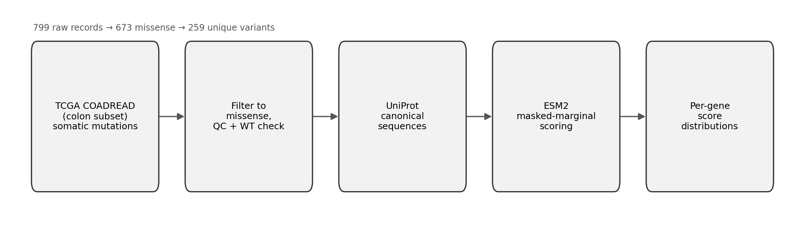
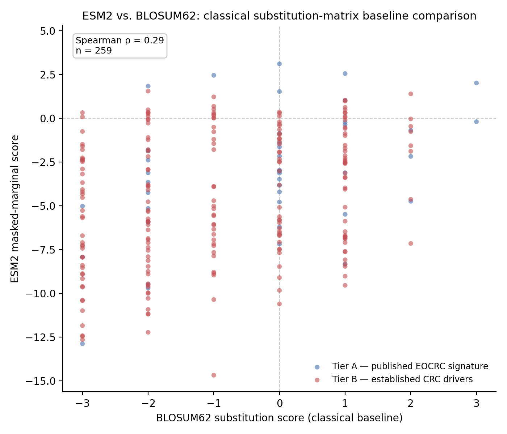

# Predicting the functional impact of colorectal cancer mutations with ESM2

A protein language model, applied zero-shot to real somatic mutations from colorectal tumors, asking a simple question: does the model find these substitutions surprising?

## The question

Cancer sequencing turns up thousands of mutations per tumor type, most of them never functionally tested. ESM2 is a protein language model trained on millions of sequences to do one thing: given a protein with one amino acid hidden, guess what belongs there. That's it — no cancer biology, no labeled training data, nothing task-specific.

It turns out that "guess what belongs here" is a decent proxy for "is this position under selective pressure to stay the same." If the model is confident a position should be, say, an arginine, and a real tumor has a mutation swapping in a tryptophan, the model's surprise at that substitution is a signal worth checking against what we already know about the gene.

This project scores real missense mutations from a public colorectal cancer cohort with ESM2 and asks whether that signal lines up with things that are already independently known — and, just as importantly, reports the cases where it doesn't.



## Data

- **Mutations**: TCGA COADREAD (colon + rectal adenocarcinoma, Pan-Cancer Atlas), restricted to the colon-only sample subset (439 patients), pulled via the [cBioPortal API](https://www.cbioportal.org/api).
- **Genes**: 14 total, in two tiers.
  - **Tier A** — the 8-gene early-onset colorectal cancer signature from Marx et al. (2024): `ALDOB`, `FBXL16`, `IL1RN`, `METTL27` (published as *WBSCR27*), `MSLN`, `RAC3`, `SLC38A11`, `WNT11`.
  - **Tier B** — six genes independently established as recurrent CRC somatic drivers by the TCGA colorectal landmark study (Muzny et al., 2012): `TP53`, `KRAS`, `PIK3CA`, `FBXW7`, `BRAF`, `SMAD4`.
- **Sequences**: canonical reviewed human entries from UniProt.

Full provenance, including why these specific genes and not others (APC and TGFBR2 were considered and excluded — their real mutation spectra are dominated by types this method can't score), is in [`docs/decision_log.md`](docs/decision_log.md).

## What ESM2 actually does here

For each observed mutation (wild-type residue → mutant residue at position *i*):

1. Mask position *i* in the protein sequence.
2. Ask ESM2 for its predicted probability of every amino acid at that position.
3. Score = log P(mutant) − log P(wild-type).

A strongly negative score means the model finds the mutant far less likely than the original residue at that spot — the substitution is *model-disfavored*. That's a statement about sequence conservation, not a diagnosis. It is **not**:

- a pathogenicity call
- a probability of clinical harm
- an experimentally measured effect on protein function
- specific to cancer at all (ESM2 has never seen a label indicating "cancer mutation")

Full method, including how proteins longer than ESM2's ~1,022-residue context window are handled (PIK3CA is 1,068 residues), is in [`docs/methodology.md`](docs/methodology.md).

## Results

259 unique missense variants were scored, from 673 mutation instances passing quality control across 439 patients.


Tier B splits into two groups: TP53, KRAS, FBXW7, and BRAF cluster strongly model-disfavored, while PIK3CA and SMAD4 sit close to zero.


Checking against known mutation hotspots gives a mixed picture: BRAF's V600E scores more negative than the gene's other positions, matching expectation. KRAS's canonical hotspot codons (G12/G13/Q61) actually score less negative than the gene's other observed positions. PIK3CA shows no meaningful separation between hotspot and non-hotspot positions.


A secondary cross-check against ClinVar (matching exact protein positions against clinical variant classifications) was adequately powered for one gene, KRAS, where pathogenic- and benign-labeled variants scored nearly identically. Most of KRAS's matched ClinVar entries come from an unrelated developmental syndrome rather than oncogenic mutations, which is a reasonable explanation for the lack of separation.

A classical baseline comparison against BLOSUM62 — a standard substitution matrix built from observed substitution frequencies across aligned protein families, which captures general evolutionary substitution patterns but no position-specific information about the particular protein a mutation falls in — checks how much of ESM2's signal is explained by that general substitution behavior alone. The overall relationship is weak-to-moderate (Spearman ρ = 0.29, n = 259) and varies by gene: BRAF correlates strongly with the classical baseline (ρ = 0.90, n = 8), most other genes more weakly.



Full tables: [`results/tables/`](results/tables/). Method details: [`docs/methodology.md`](docs/methodology.md).

## Scope

This is a computational, sequence-based analysis — not a clinical or experimental study, and not a claim of diagnostic or predictive validity. Full discussion of scope and limitations: [`docs/limitations.md`](docs/limitations.md).

## Reproducing this

```bash
pip install -r requirements.txt
python src/01_pull_mutations.py        # cBioPortal -> data/raw/
python src/02_fetch_sequences.py       # UniProt -> data/raw/
python src/03_filter_and_qc.py         # -> data/processed/
python src/04_score_esm2.py            # -> data/scored/  (checkpoints automatically; ~15-20 min on CPU)
python src/05_primary_analysis.py      # -> results/tables/
python src/06_hotspot_concordance.py   # -> results/tables/
python src/07_clinvar_secondary.py     # -> results/tables/  (hits NCBI E-utilities, rate-limited)
python src/08_generate_figures.py      # -> results/figures/
python src/09_baseline_comparison.py   # -> results/tables/ + results/figures/ (BLOSUM62 vs ESM2)
```

Tests: `pytest tests/`

## Repository map

```
src/                  pipeline scripts, run in numeric order
data/raw/             unmodified API pulls (mutations, sequences)
data/processed/       QC'd and deduplicated variant table, plus the full exclusion audit trail
data/scored/          final ESM2-scored variant table
results/tables/       per-gene summaries, hotspot and ClinVar checks
results/figures/      the five figures above
docs/                 methodology, decision log, limitations
tests/                unit tests for the parsing, QC, and windowing logic
```

## Method reference

Masked-marginal scoring: Meier, J. et al. "Language models enable zero-shot prediction of the effects of mutations on protein function." *NeurIPS* 2021.

Model: Lin, Z. et al. "Evolutionary-scale prediction of atomic-level protein structure with a language model." *Science* 2023. (`facebook/esm2_t33_650M_UR50D`, via HuggingFace `transformers`)

EOCRC signature: Marx, O.M. et al. *Frontiers in Oncology* 2024.

CRC driver frequencies: Muzny, D. et al. "Comprehensive molecular characterization of human colon and rectal cancer." *Nature* 2012.
